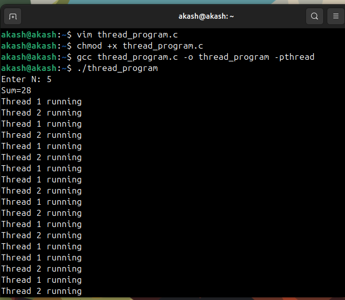

# Output Screen Captures

## Question 1) Write a C program to define 3 different threads:

- Thread A: Calculate sum of first N prime numbers  
- Thread B & C: Run in parallel, printing every 2s and 3s respectively for 100s  

**File Name:**  
`Q1 Thread_Program.c`

**Output Screenshot:**  
  

## Question 2) Add signal handling and track execution time

**File Name:**  
`Q2 Thread_Program_Extended.c`

**Output Screenshot:**  
   
