# Akash_Linux Training_Module 1

## Solutions

### 1) Create a file and add executable permission to all users (user, group and others)
**Commands**:
```bash
# Create a file
touch myfile.sh

# Add executable permissions for user, group, and others
chmod +x myfile.sh

# Verify permissions
ls -l myfile.sh
```

**Explanation**:  
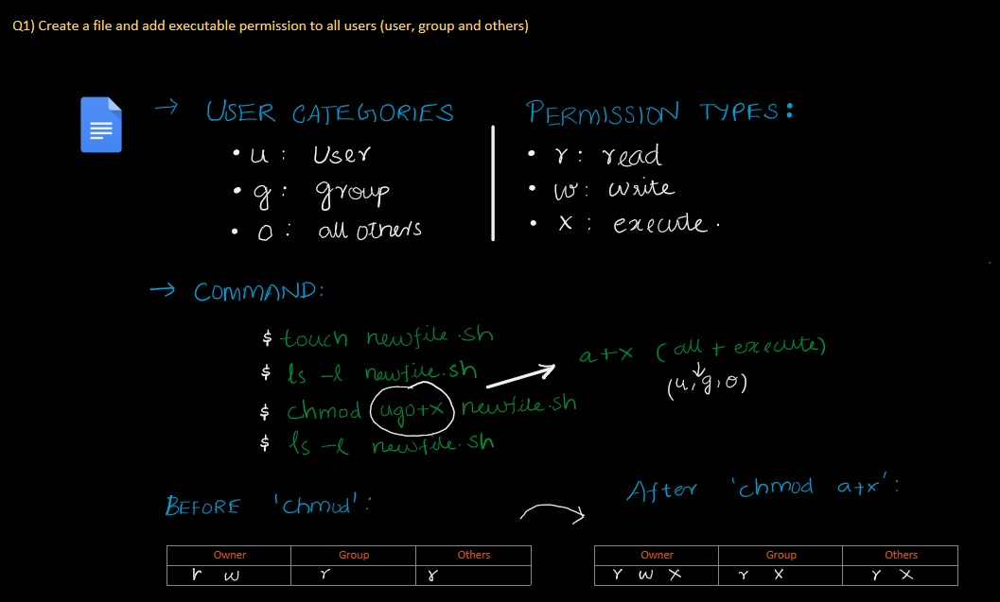  

**Output**:  
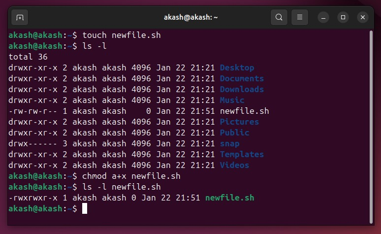  

---

### 2) Create a file and remove write permission for group user alone
**Commands**:
```bash
# Create a file
touch myfile.txt

# Remove write permission for group user
chmod g-w myfile.txt

# Verify permissions
ls -l myfile.txt
```

**Explanation**:  
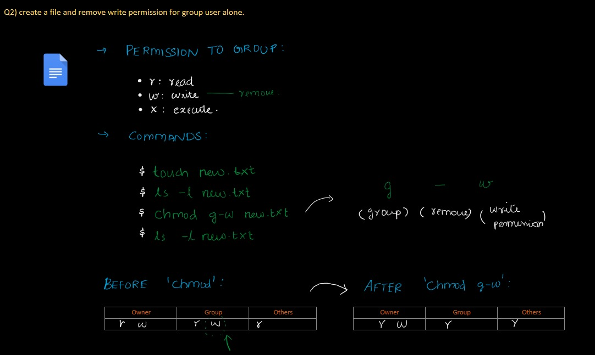  

**Output**:  
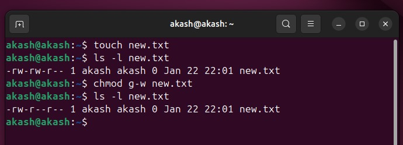  

---

### 3) Create a file and add a softlink to the file in different directory (Eg : Create a file in dir1/dir2/file and create a softlink for file inside dir1)
**Commands**:
```bash
# Create directories
mkdir -p dir1/dir2

# Create a file in dir2
cd dir1/dir2
touch file.txt

# Go back to dir1
cd ../

# Create a softlink in dir1 for file in dir2
ln -s dir2/file.txt file_softlink.txt

# Verify softlink
ls -l
```

**Explanation**:  
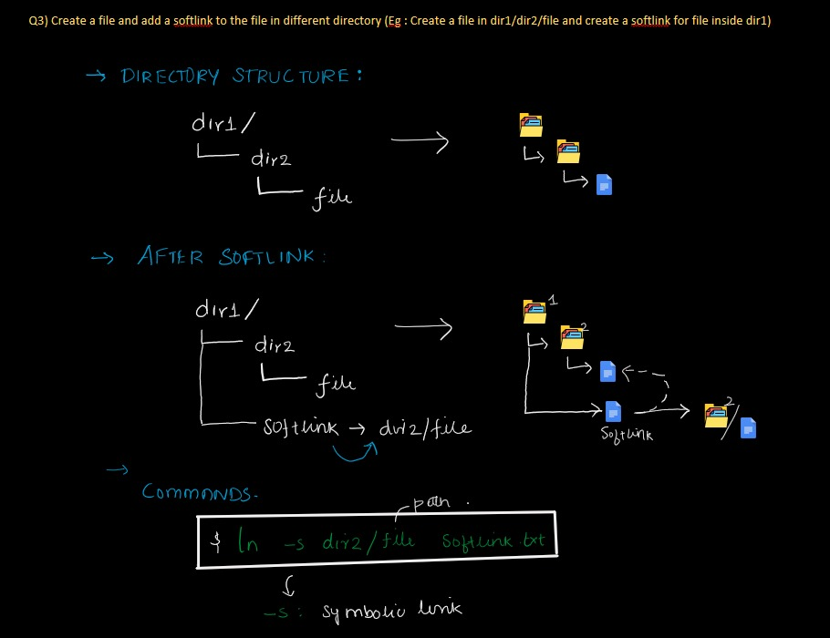  

**Output**:  
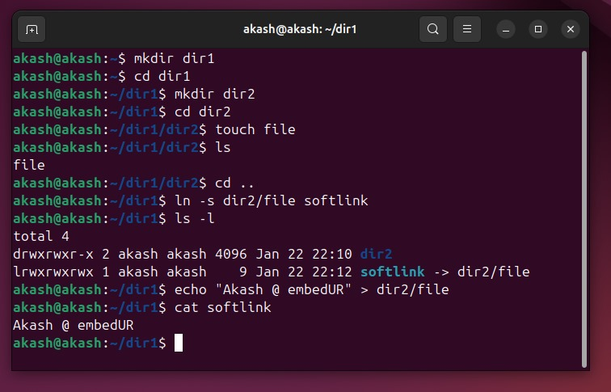  

---

### 4) Use ps command with options to display all active processes running on the system
**Commands**:
```bash
# Display all active processes
ps -e

# Display all processes along with additional information (user, CPU, memory usage)
ps aux

# Filter a specific process (replace "process_name" with the actual process name)
ps -e | grep process_name
```

**Explanation**:  
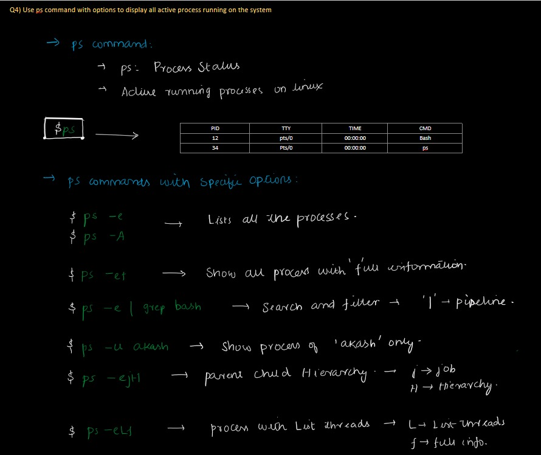  

**Output**:  
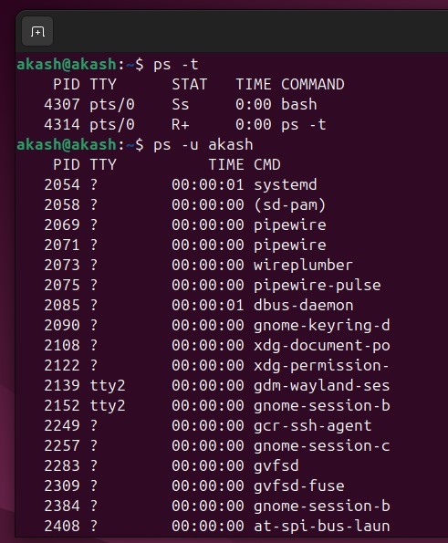  
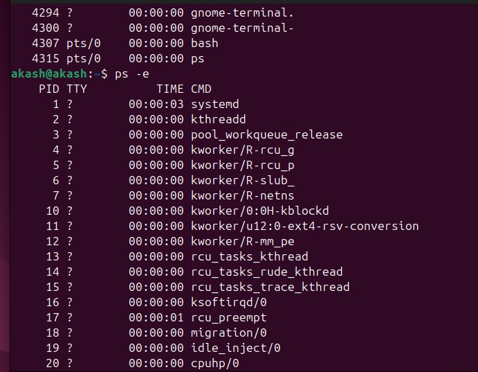  
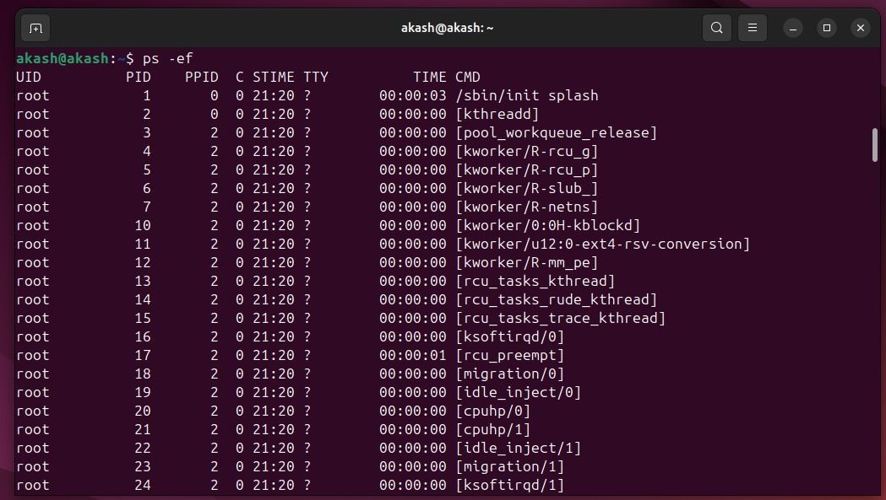  
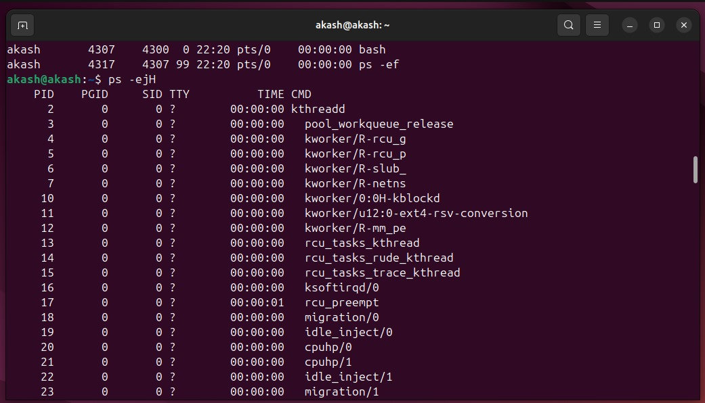  
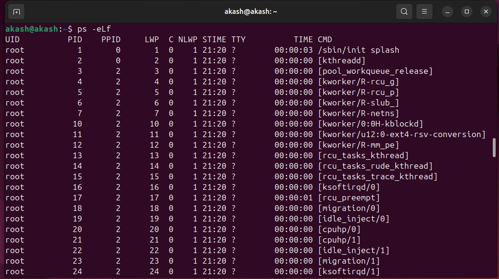  
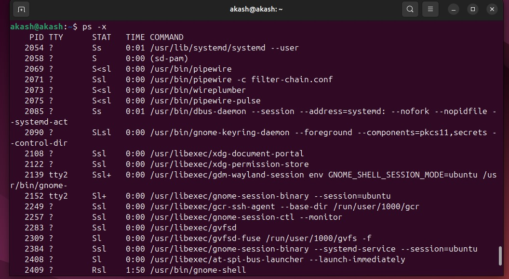  

---

### 5) Create 3 files in a dir1 and re-direct the output of list command with sorted by timestamp of the files to a file
**Commands**:
```bash
# Create a directory
mkdir dir1

# Navigate to dir1
cd dir1

# Create 3 files
touch file1.txt file2.txt file3.txt

# Modify timestamps to simulate changes
touch -t 202501230900 file1.txt
touch -t 202501230930 file2.txt
touch -t 202501231000 file3.txt

# List files sorted by timestamp and redirect output to a file
ls -lt > sorted_files.txt

# Verify the output file
cat sorted_files.txt
```

**Explanation**:  
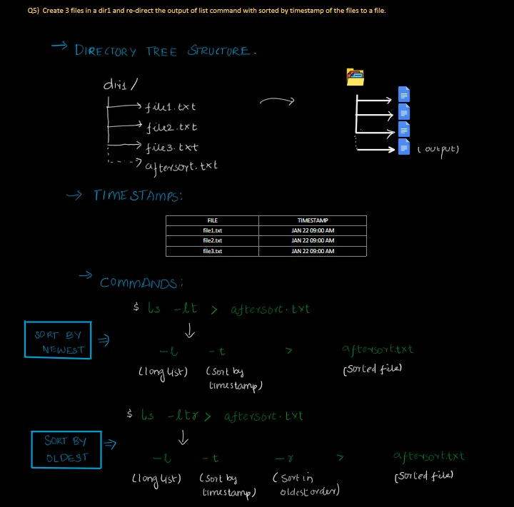  

**Test Cases**:  
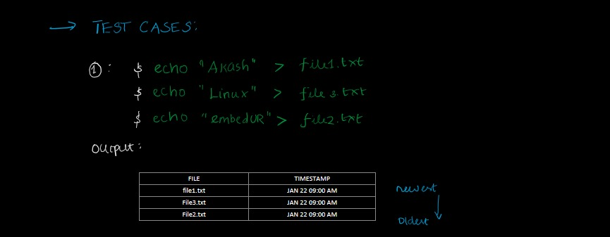  

**Output**:  
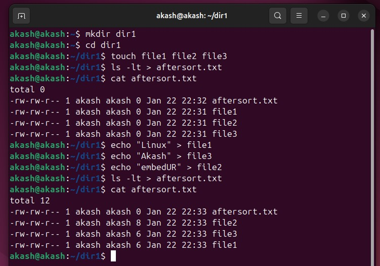
