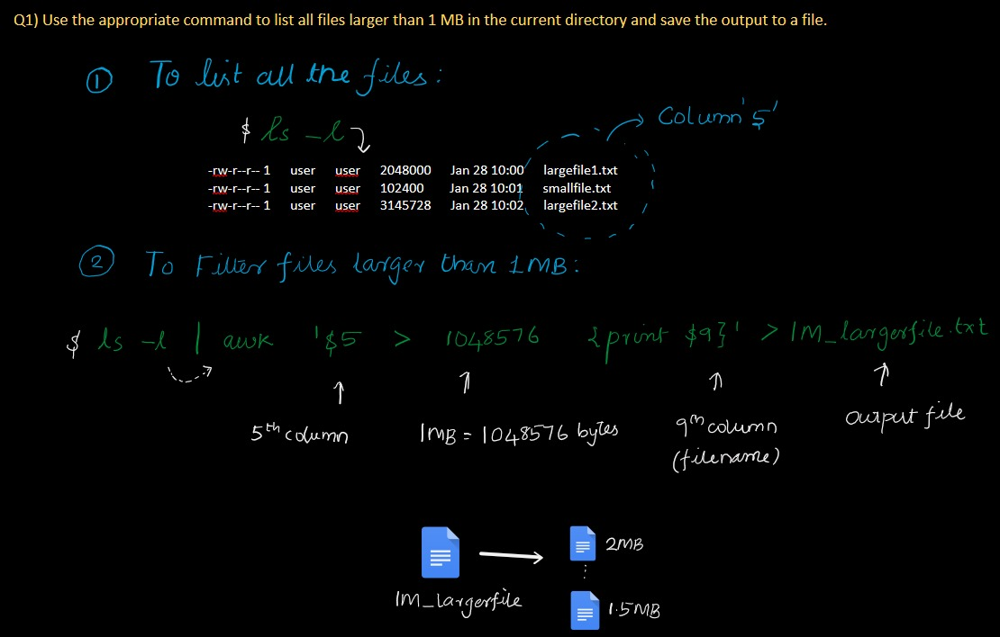
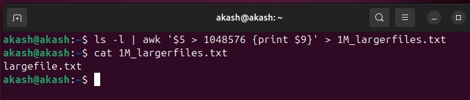
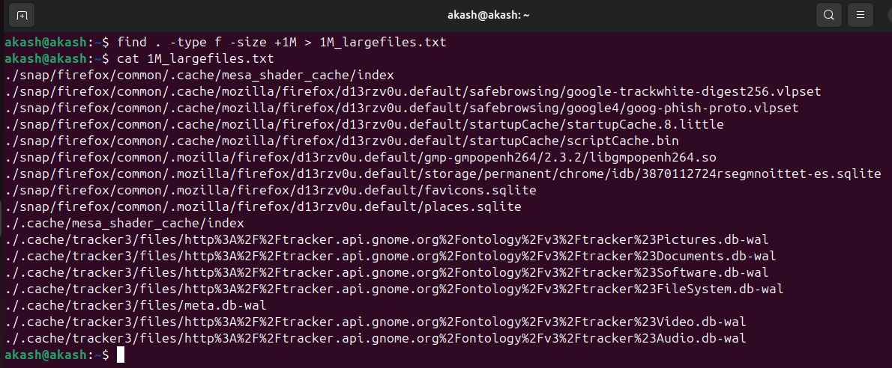
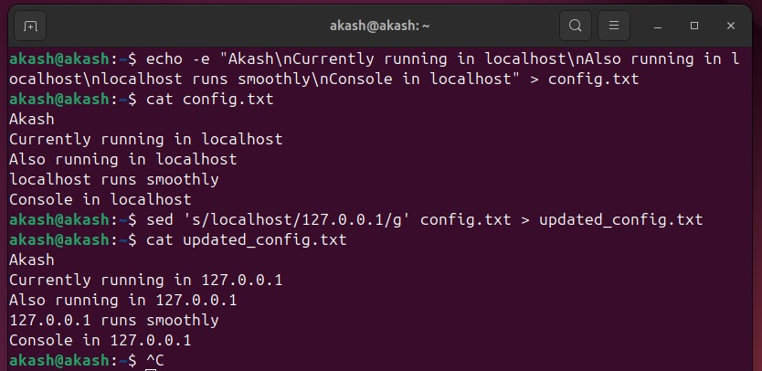
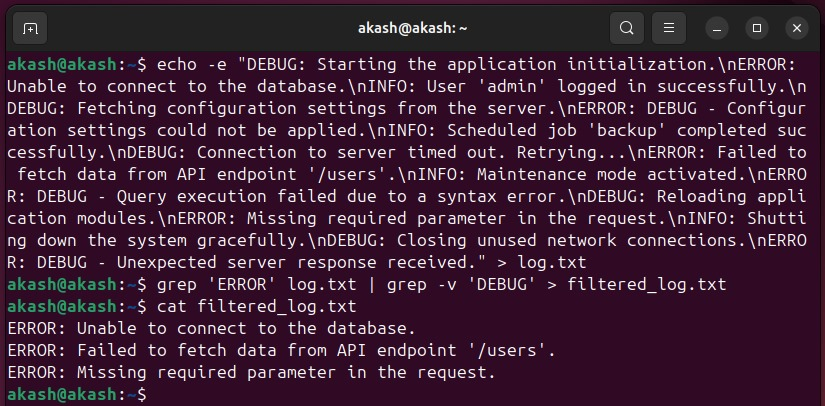
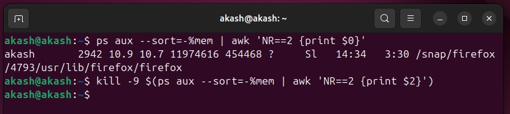
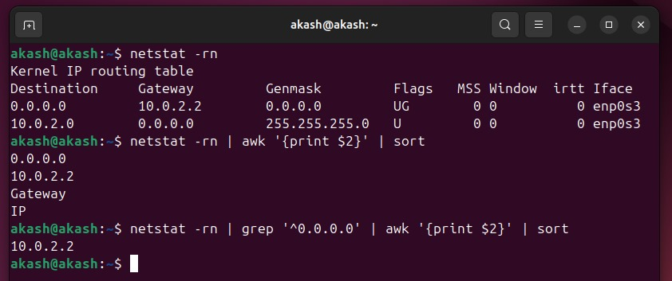

# Akash_Linux Training Module 2

## Solutions

### Q1) List large files in the current directory
**Commands**:
```bash
ls -l | awk '$5 > 1048576 {print $9}' > 1M_largerfiles.txt
cat 1M_largerfiles.txt
```

**Explanation**:  
  

**Output**:  
  


---

### Q2) Replace localhost with 127.0.0.1 in a configuration file
**Commands**:
```bash
sed 's/localhost/127.0.0.1/g' config.txt > updated_config.txt
```

**Explanation**:  


**Output**:  


---

### Q3) Filter log file to exclude lines containing DEBUG
**Commands**:
```bash
grep "ERROR" log.txt | grep -v "DEBUG" > filtered_log.txt
cat filtered_log.txt
```

**Explanation**:  


**Output**:  


---

### Q4) Identify and terminate the process with the highest memory usage
**Commands**:
```bash
ps aux --sort=-%mem | awk 'NR==2 {print $0}'
kill -9 $(ps aux --sort=-%mem | awk 'NR==2 {print $2}')
```

**Explanation**:  


**Output**:  


---

### Q5) Show available gateways
**Commands**:
```bash
netstat -rn
netstat -rn | awk '{print $3}' | sort
netstat -rn | grep '^0.0.0.0' | awk '{print $3}' | sort
```

**Explanation**:  


**Output**:  


---
