# Akash_Linux Training_Module 3

## Solutions

### Consolidated Output

**Script File**: `backup_manager.sh`  
**Report**:  

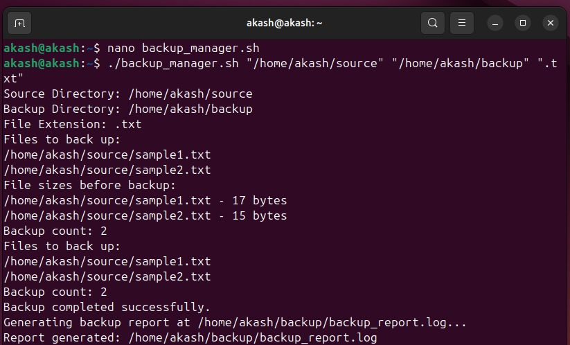  
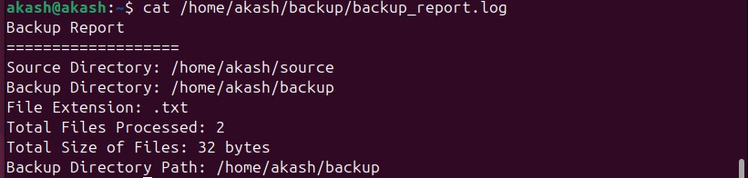  
-----

### 1) Quoting
**Commands**:
```bash
nano backup_manager.sh
chmod +x backup_manager.sh
./backup_manager.sh "/home/akash/source" "/home/akash/backup" ".txt"
```
**Explanation**:  
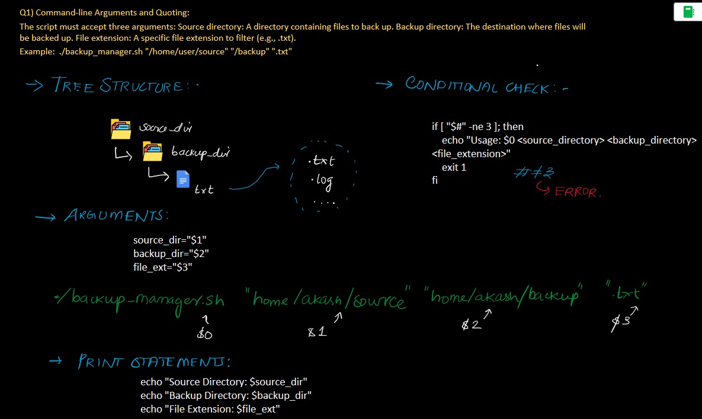  
**Output**:  
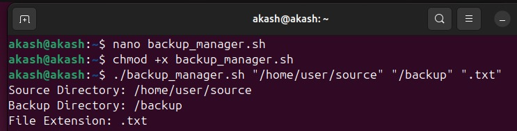  

---

### 2) Globbing
**Commands**:
```bash
nano backup_manager.sh
./backup_manager.sh "/home/akash/source" "/home/akash/backup" ".txt"
```
**Explanation**:  
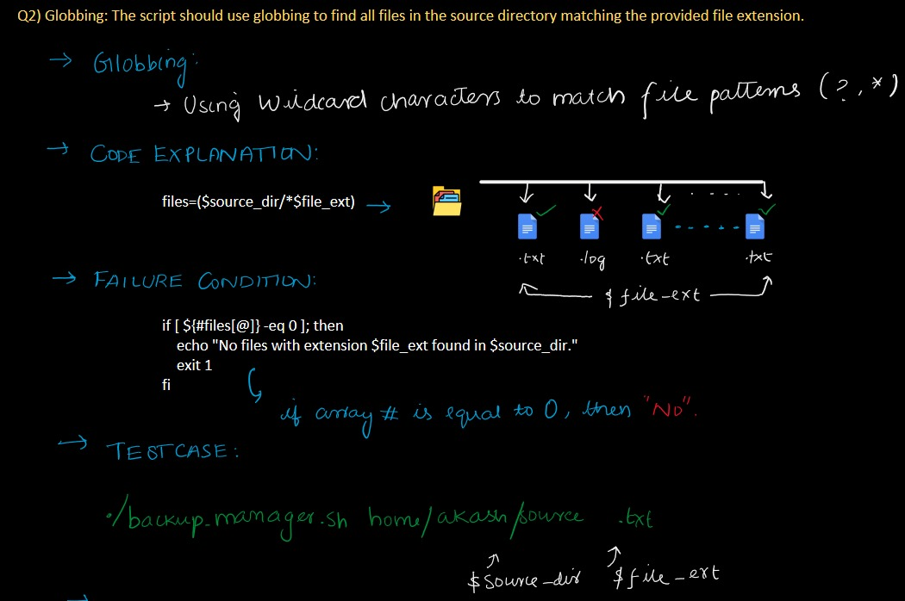  
**Output**:  
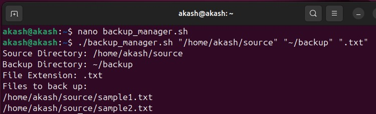  

---

### 3) Export Statements
**Commands**:
```bash
nano backup_manager.sh
./backup_manager.sh "/home/akash/source" "/home/akash/backup" ".txt"
```
**Explanation**:  
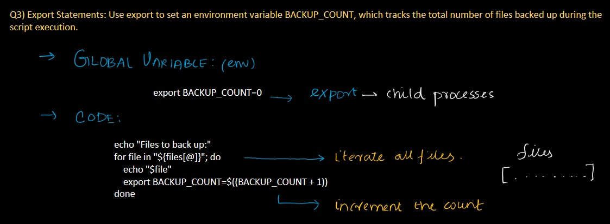  
**Output**:  
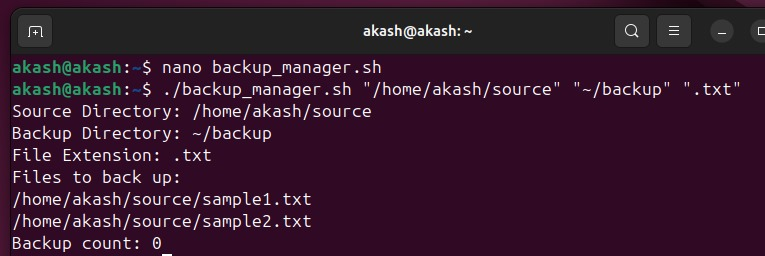  

---

### 4) Array Operation
**Commands**:
```bash
nano backup_manager.sh
./backup_manager.sh "/home/akash/source" "/home/akash/backup" ".txt"
```
**Explanation**:  
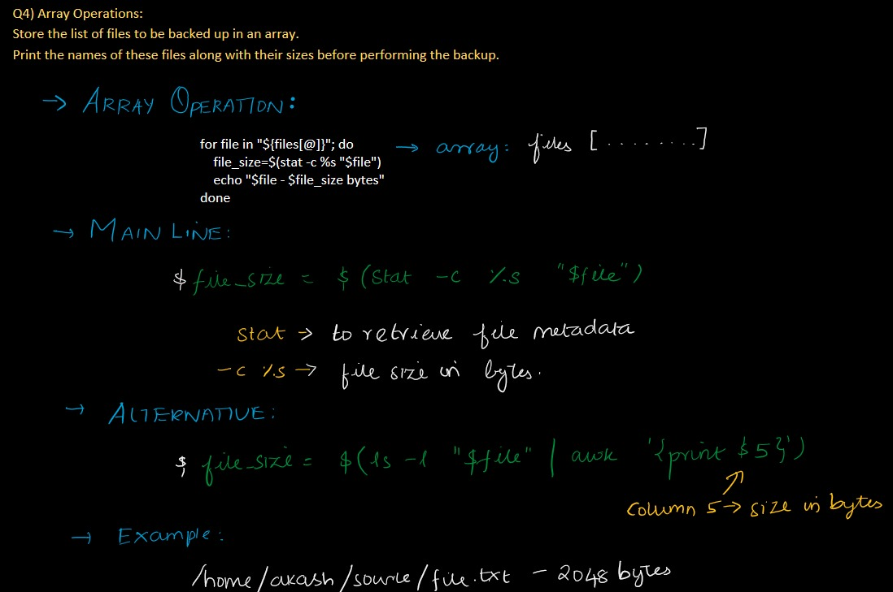  
**Output**:  
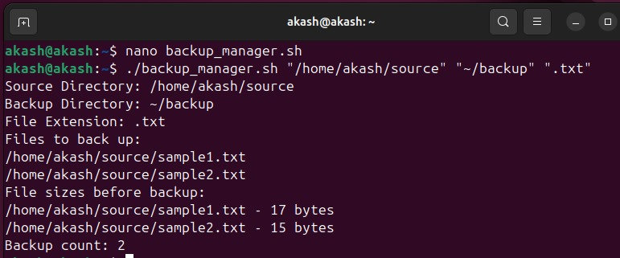  

---

### 5) Conditional Execution
**Commands**:
```bash
nano backup_manager.sh
./backup_manager.sh "/home/akash/source" "/home/akash/backup" ".txt"
```
**Explanation**:  
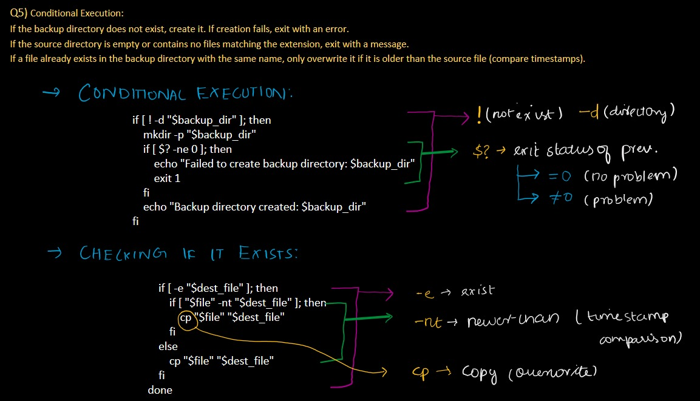  
**Output**:  
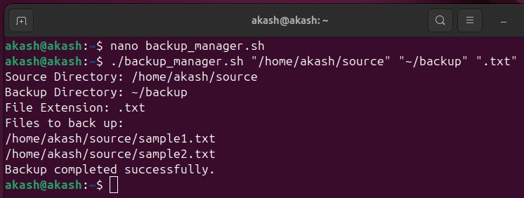  

---

### 6) Output Report
**Commands**:
```bash
nano backup_manager.sh
./backup_manager.sh "/home/akash/source" "/home/akash/backup" ".txt"
```
**Explanation**:  
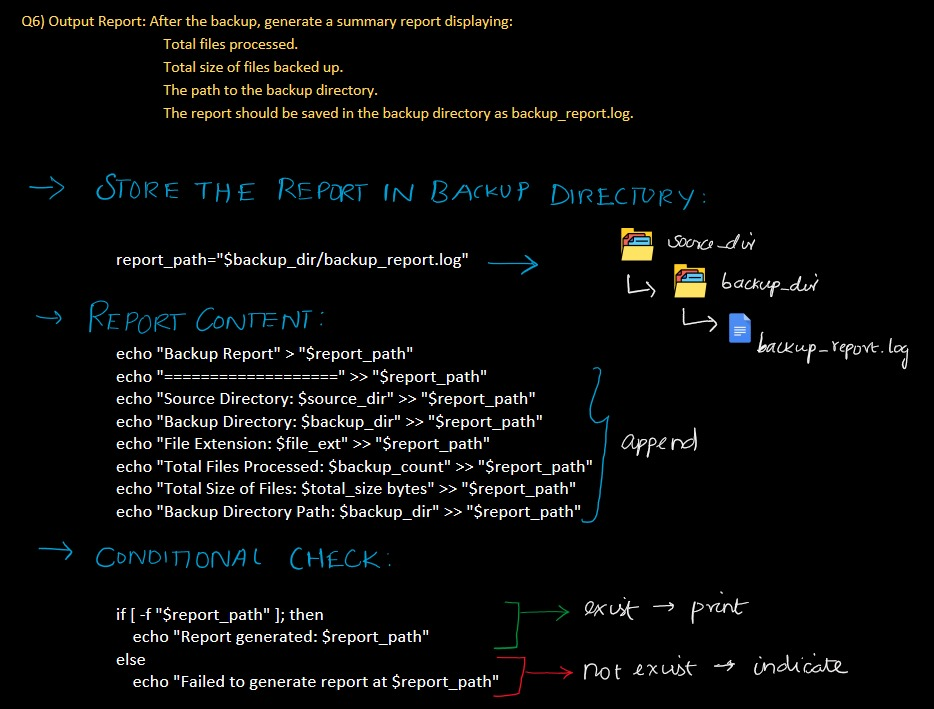  
**Output**:  
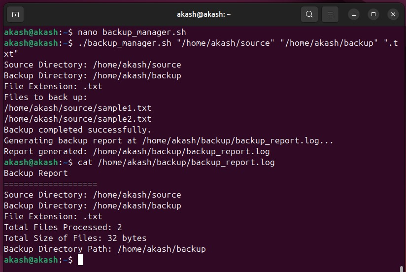  

---

### Project Tree
```
Akash_Linux_Training_Module_3
│-- backup_manager.sh
│-- Q1_Quoting.sh
│-- Q2_Globbing.sh
│-- Q3_Export_Statements.sh
│-- Q4_Array_Operation.sh
│-- Q5_Conditional_Execution.sh
│-- Q6_Output_Report.sh
│
└── screenshots/
