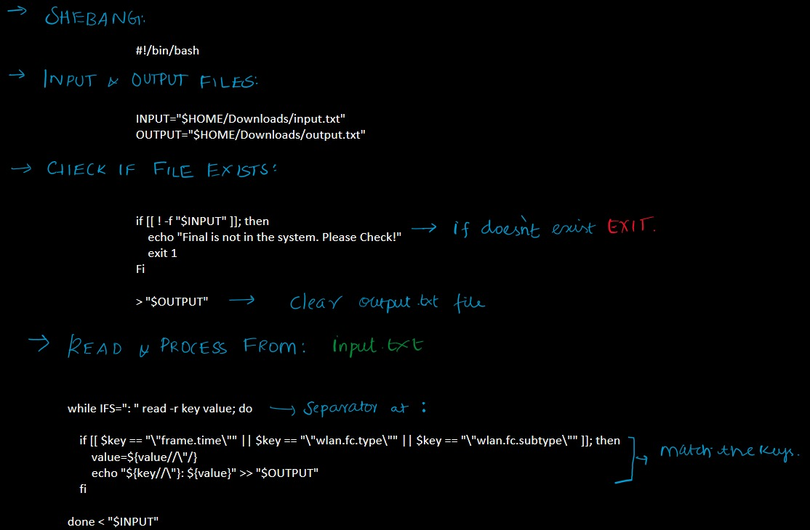
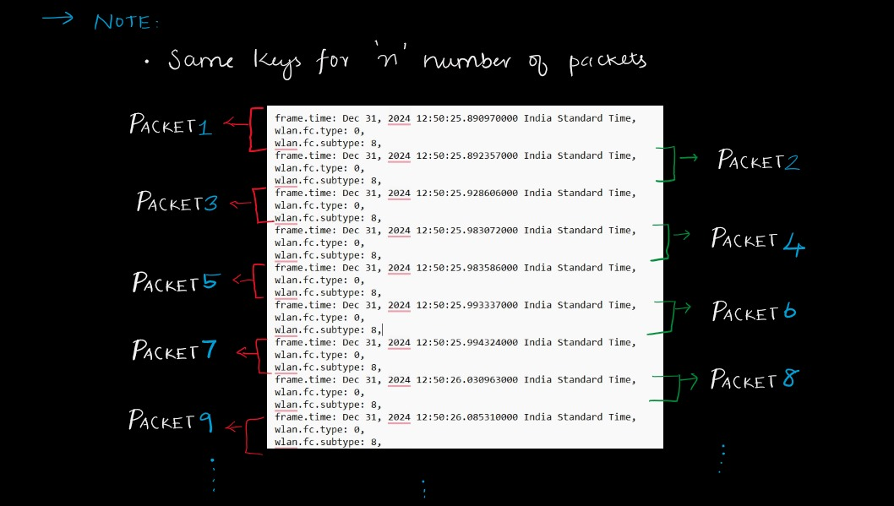
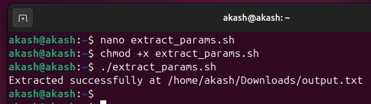
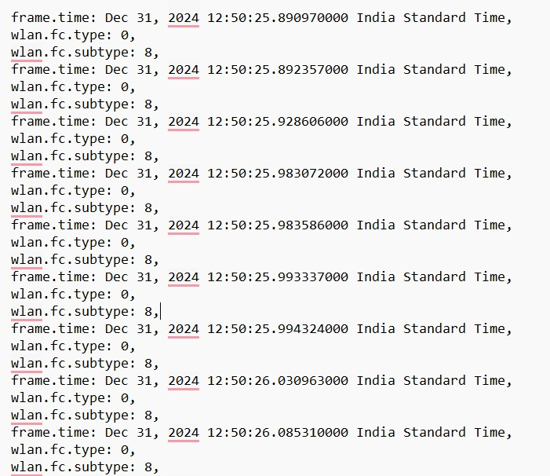

# Akash_Linux Training_Module 4

## Solution

### Question
For the attached file, write a bash script which should take the file as input and have to go through it line by line and need to generate an output file (say output.txt) with listings of the following parameters fetched from the input file.

Params expected to be fetched from `input.txt` file: `frame.time`, `wlan.fc.type`, `wlan.fc.subtype`

### Necessities:
- **Input file**: `input.txt`
- **Output file**: `output.txt`
- **Shell script**: `extract_params.sh`

### Explanation:




### Terminal Output:


### File Output:
**output.txt**  


---

### Project Tree
```
Akash_Linux_Training_Module_4
│-- extract_params.sh
│-- input.txt
│-- output.txt
│
└── screenshots/
    │-- Module4Explanation1.jpg
    │-- Module4Output1.jpg
    │-- Module4Output2.jpg
```

---

### Footer:
**Akash S**  
*embedUR systems*
