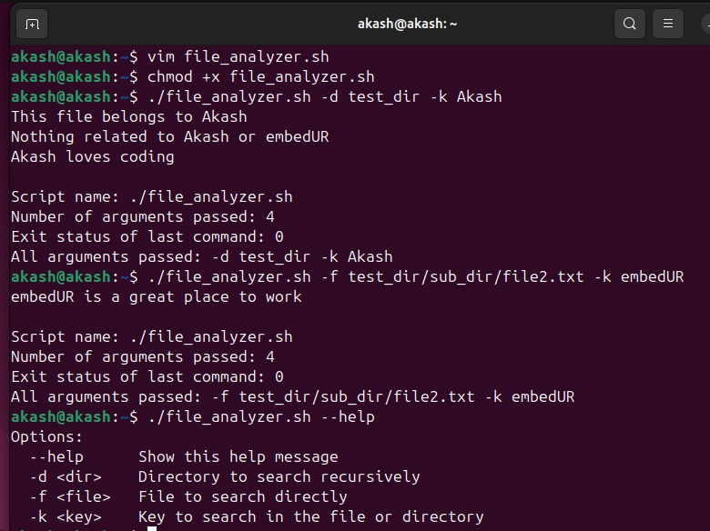
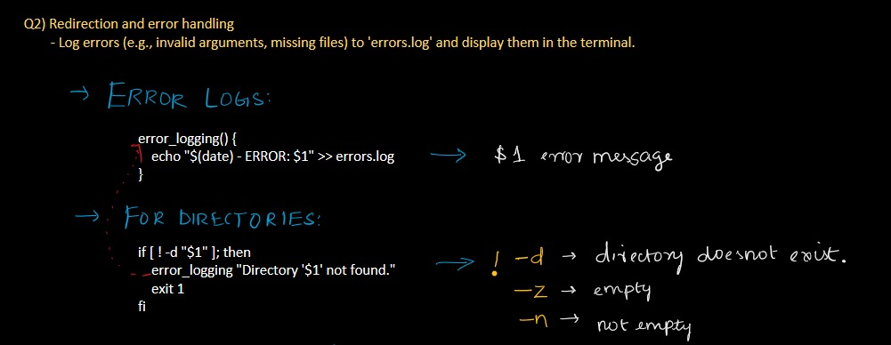
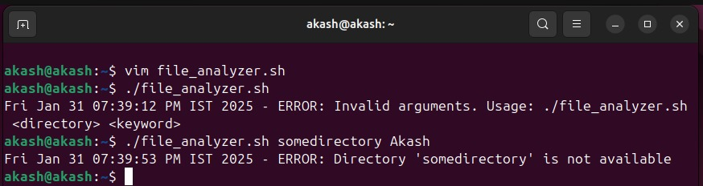
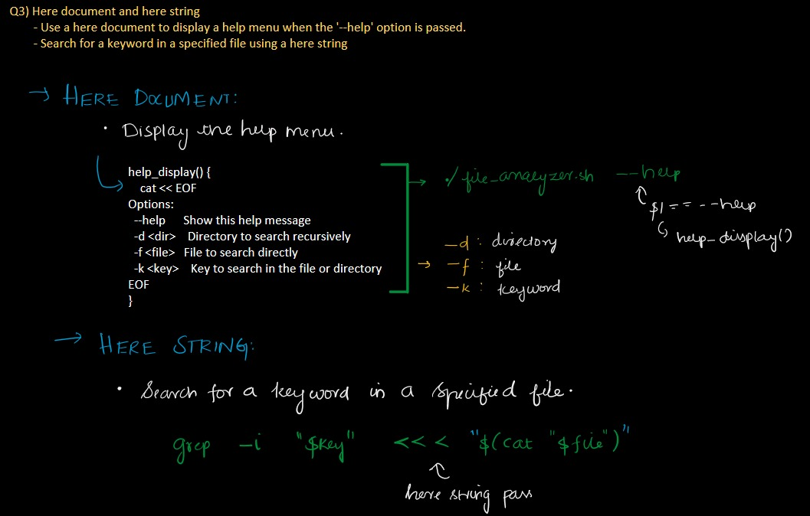
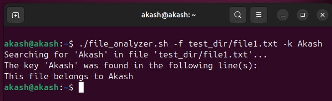
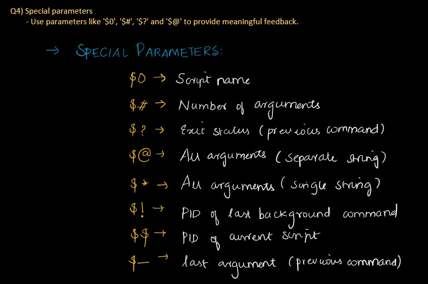
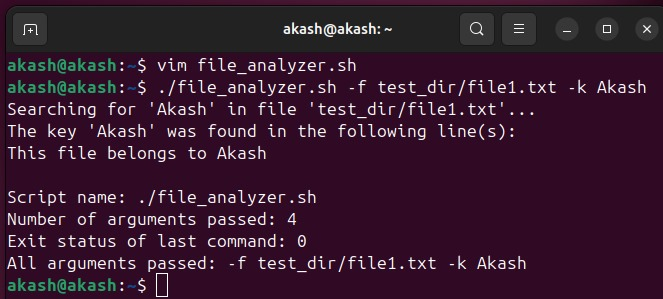
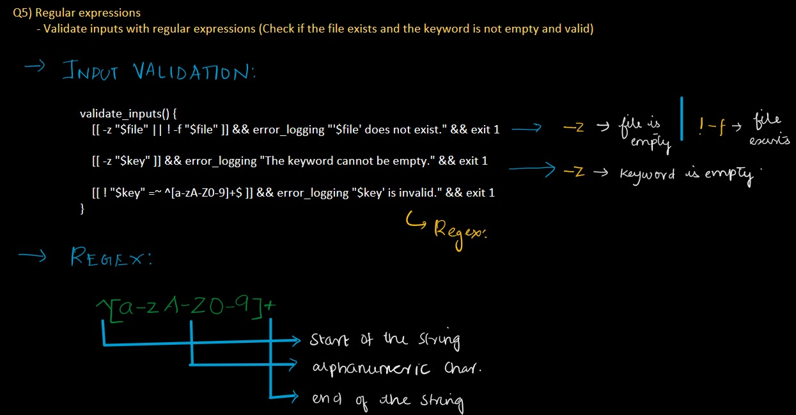
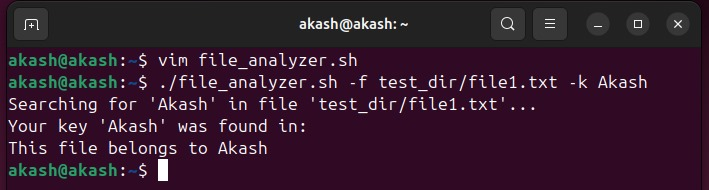
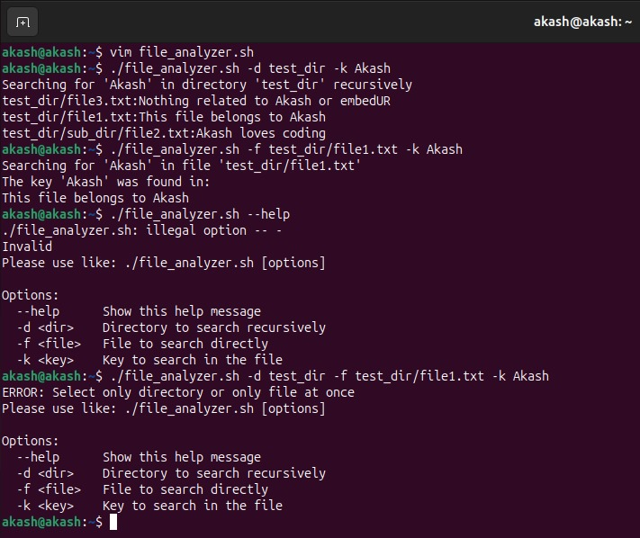

# Akash_Linux Training_Module 5

## Solutions

### Consolidated Output

**Script File**: `file_analyzer.sh`  
**Output**:  
  
-----

### 1) Recursive Functions
**Explanation**:  
  
**Output**:  
  

---

### 2) Redirection and Error Handling
**Explanation**:  
  
**Output**:  
  

---

### 3) Here Document and Here String
**Explanation**:  
  
**Output**:  
  

---

### 4) Special Parameters
**Explanation**:  
  
**Output**:  
  

---

### 5) Regular Expressions
**Explanation**:  
  
**Output**:  
  

---

### 6) Command-line Arguments using getopts
**Explanation**:  
  
**Output**:  
  

---

### Project Tree
```
Akash_Linux_Training_Module_5
│-- file_analyzer.sh
│-- README.md
│
└── screenshots/
```
