# Akash_Linux Training_Module 1

## Solutions

### 1) Create a file and add executable permission to all users (user, group and others)
**Commands**:
```bash
touch newfile.sh
chmod a+x newfile.sh
ls -l newfile.sh
```

**Explanation**:  
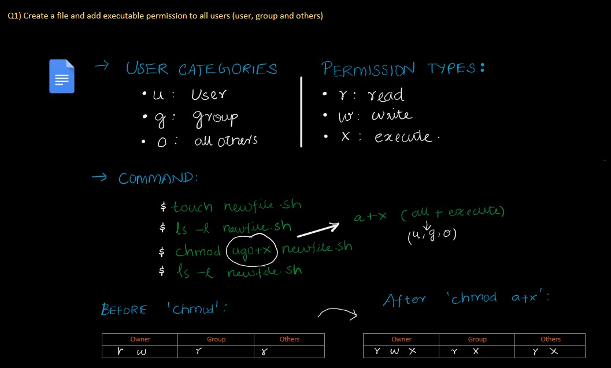  

**Output**:  
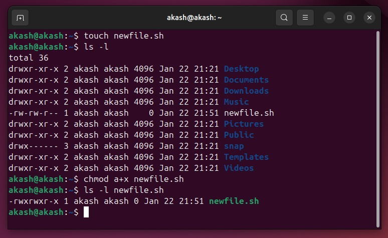  

---

### 2) Create a file and remove write permission for group user alone
**Commands**:
```bash
touch new.txt
chmod g-2 new.txt
ls -l new.txt
```

**Explanation**:  
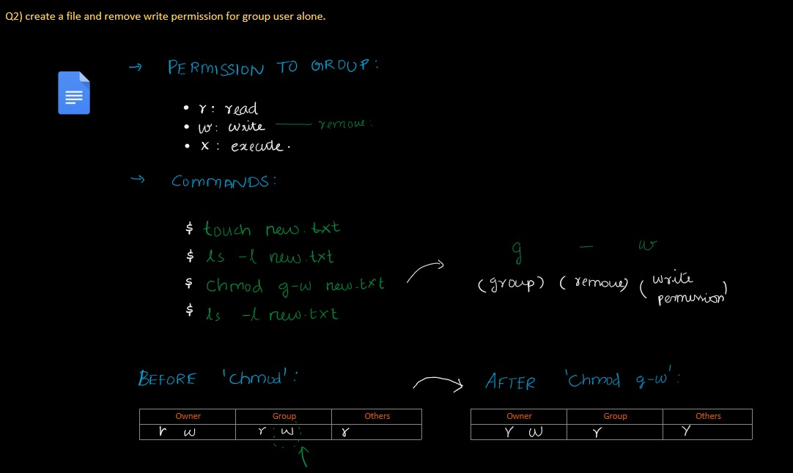  

**Output**:  
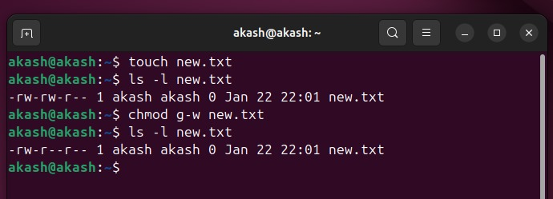  

---

### 3) Create a file and add a softlink to the file in different directory (Eg : Create a file in dir1/dir2/file and create a softlink for file inside dir1)
**Commands**:
```bash

mkdir dir1
cd dir1
mkdir dir2
cd dir2
touch file.txt
cd ../
ln -s dir2/file.txt softlink.txt
echo "Akash @ embedUR" > softlink.txt
cat softlink.txt
```

**Explanation**:  
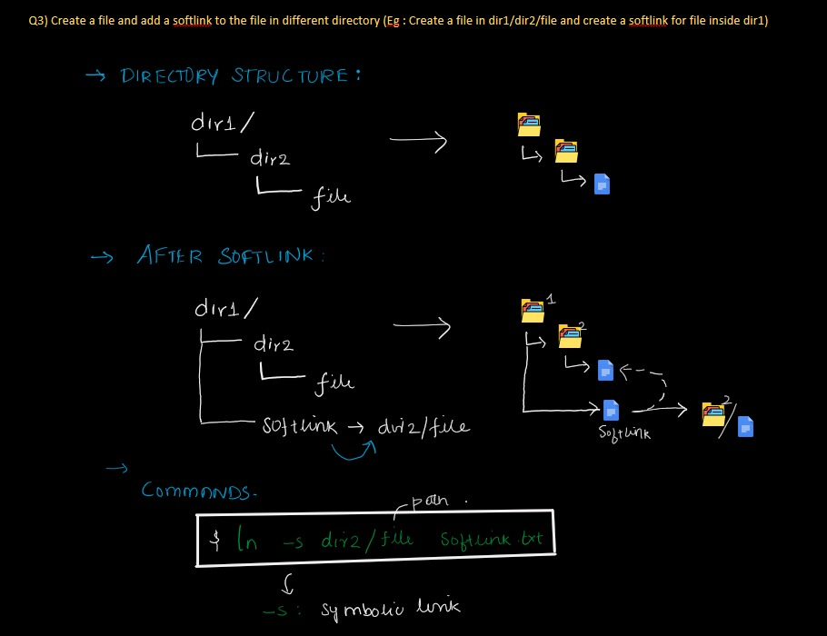  

**Output**:  
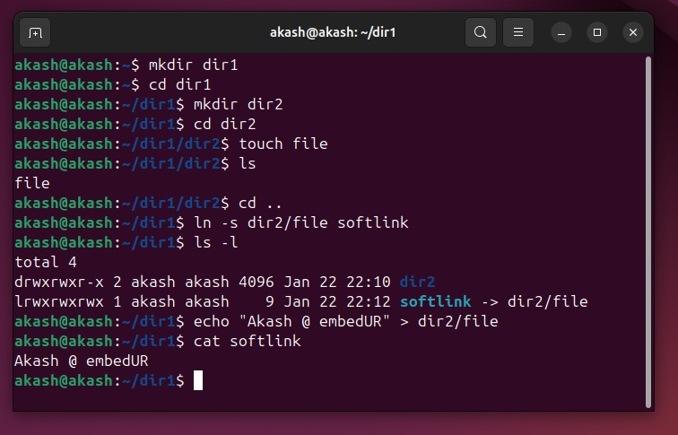  

---

### 4) Use ps command with options to display all active processes running on the system
**Commands**:
```bash
ps
ps -e
ps -ef
ps -eLf
ps -ejH
ps -t
ps -x
ps -u akash
ps -e | grep bash
```

**Explanation**:  
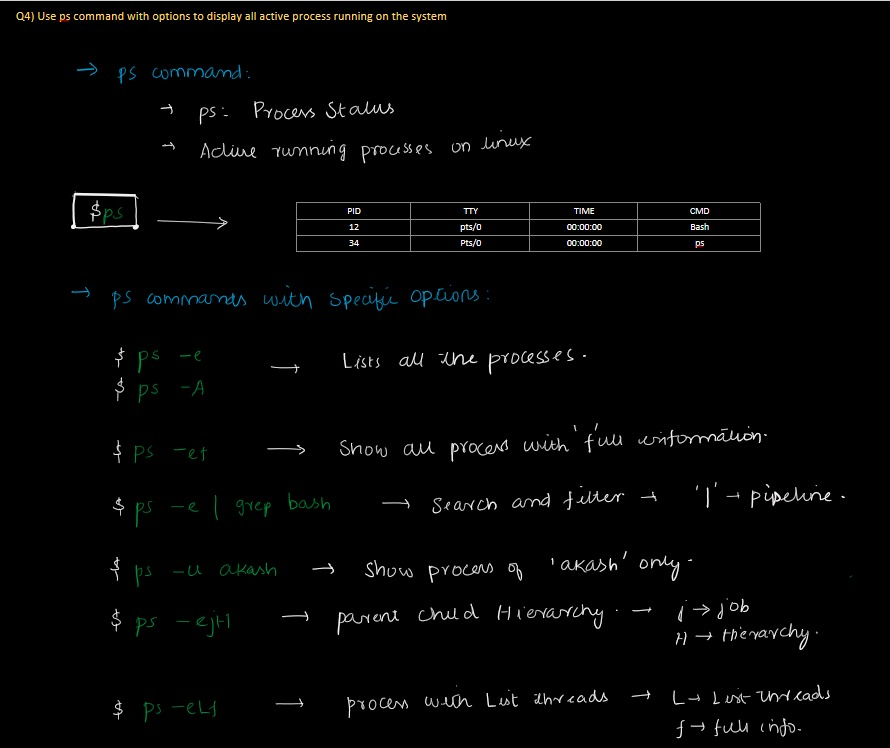  

**Output**:  
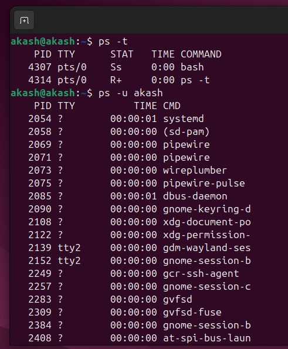  
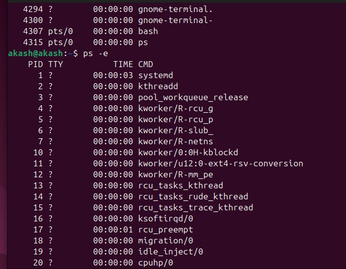  
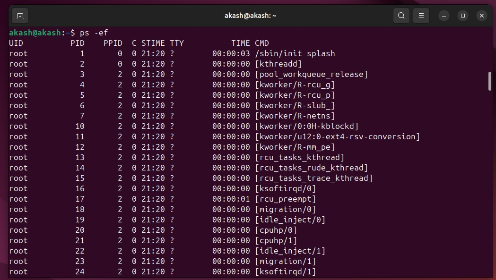  
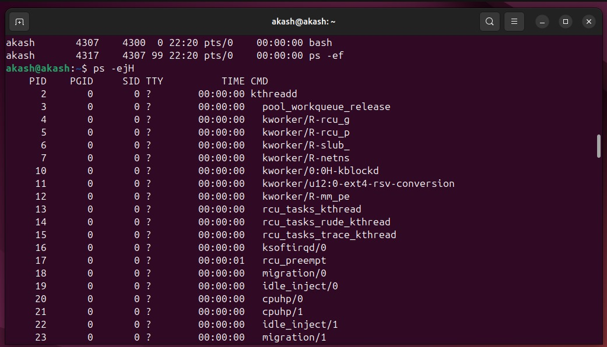  
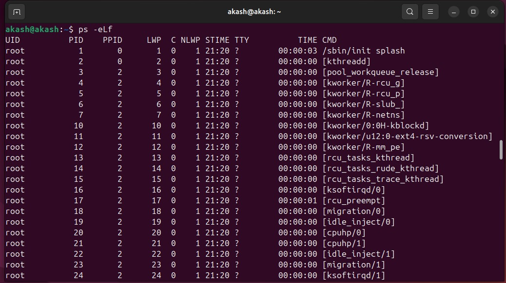  
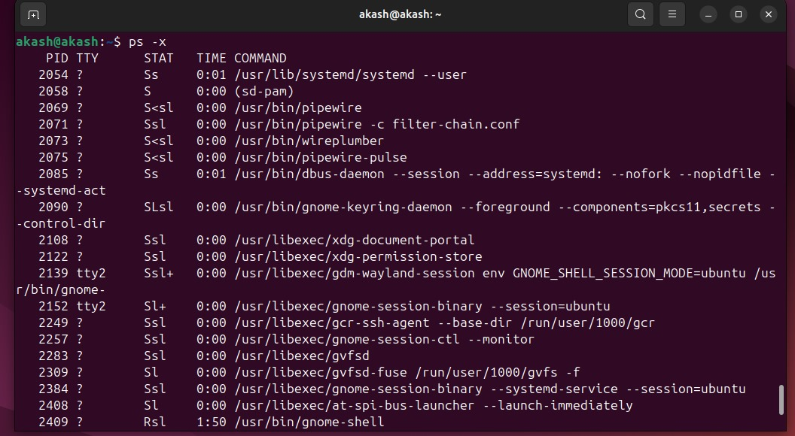  

---

### 5) Create 3 files in a dir1 and re-direct the output of list command with sorted by timestamp of the files to a file
**Commands**:
```bash
mkdir dir1
cd dir1
touch file1 file2 file3
ls -lt > aftersort.txt
echo "Akash" > file1.txt
echo "embedUR" > file3.txt
echo "Linux" > file2.txt
cat aftersort.txt
```

**Explanation**:  
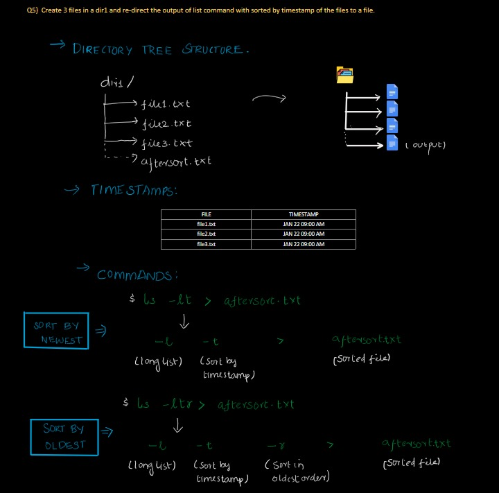  

**Test Cases**:  
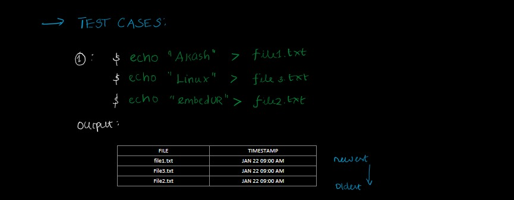  

**Output**:  
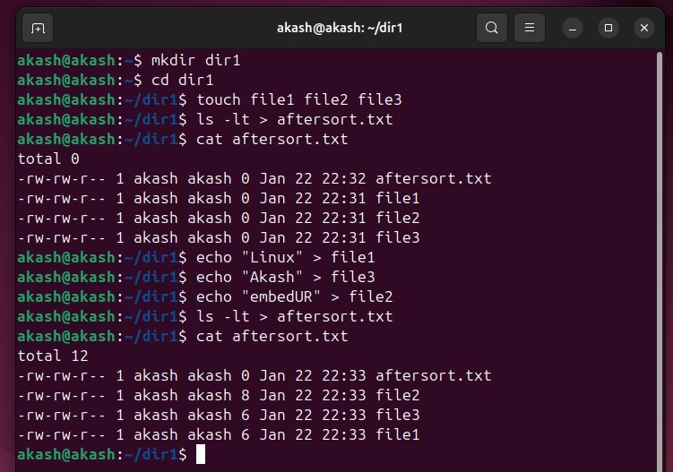

